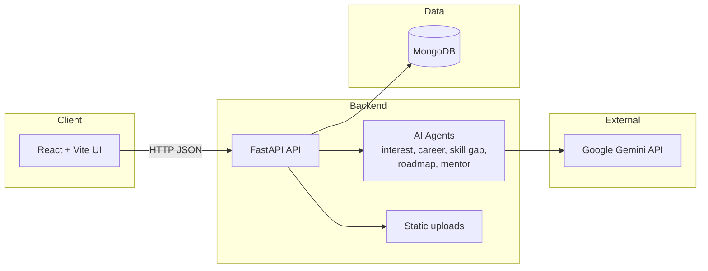

# CareerSarthi

CareerSarthi is a full-stack AI career guidance platform that builds a user profile through an adaptive questionnaire, recommends careers, analyzes skill gaps, and generates a personalized learning roadmap with progress tracking and mentor chat.

## Features

- Adaptive interest questionnaire to build a structured career profile.
- AI-driven career recommendations with match scores and reasoning.
- Skill gap analysis with missing skills and learning priorities.
- Roadmap generation with month-by-month learning plan.
- Progress tracking for roadmap skills and completion percentage.
- Activity heatmap and user stats dashboard.
- AI mentor chat with recent conversation context.
- Profile management with optional avatar upload.

## Tech stack

- Frontend: React, Vite, Tailwind CSS, Axios
- Backend: FastAPI, Uvicorn
- AI: Google Gemini (via `google-generativeai`)
- Database: MongoDB

## Architecture



## Project structure

```
backend/
	app/
		agents/          # AI agents for profile, career, skill gap, roadmap, mentor
		database/        # MongoDB connection and collections
		routes/          # API routes
		config.py        # Environment config
	requirements.txt

frontend/
	src/
		pages/           # App screens
		components/      # UI components
		services/        # API client
```

## Prerequisites

- Python 3.10+
- Node.js 18+
- MongoDB instance (local or cloud)
- Google Gemini API key

## Environment variables

Create a `.env` file in `backend/`:

```
GEMINI_API_KEY=your_gemini_api_key
MONGO_URI=mongodb://localhost:27017
```

## Run the project

### Backend

```bash
cd backend
python -m venv .venv
.venv\Scripts\activate
pip install -r requirements.txt
uvicorn app.main:app --reload --host 0.0.0.0 --port 8000
```

### Frontend

```bash
cd frontend
npm install
npm run dev
```

The frontend runs on `http://localhost:5173` and the backend runs on `http://localhost:8000`.

## API overview

Key routes exposed by the backend:

- Auth: `/auth/register`, `/auth/login`
- Profile: `/interest/start`, `/interest/next`, `/profile/check`, `/user/profile`, `/user/profile/update`
- Careers: `/career/recommend`, `/career/select`
- Roadmap: `/roadmap/generate`, `/roadmap/progress/get`, `/roadmap/progress/update`
- Analytics: `/user/stats`, `/user/skills`, `/user/career-progress`, `/user/activity`
- Mentor: `/mentor/chat`

## Notes

- The backend enables CORS for `http://localhost:5173` by default.
- File uploads are served from `/uploads` and stored under `backend/uploads/`.